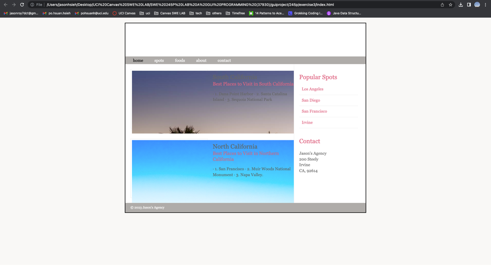

## Objective
Read, reproduce, execute, and understand codes from the HTML&CSS Design and Build Websites textbook (HTML and CSS: Design and Build Websites ).

Modify the example code from Chapter 17 in order for you to create a simple webpage of your own - you can think about using this later as your webpage!

The aim is for you to get acquainted with HTML/CSS to a point that you will feel comfortable creating simple webpages from scratch.

## The browser I used to test
Google Chrome 

## Browser version
Version 117.0.5938.149 (Official Build) (arm64)

## Operating system
macOs Apple M1 Pro

## Computer architecture:
CPU: MacBook Pro (14-inch, 2021) 14-core GPU
RAM: 16 GB DDR3

## Description
(1). Modify index.html file to make sure all the heads, links, CSS, Layout, etc. work.
(2) Test the index.html file on my Google Chrome Browser.
(3) Check if the index.html works on the Google Chrome Browser.

## Screenshots
